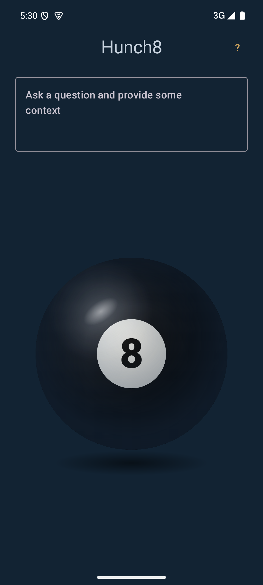
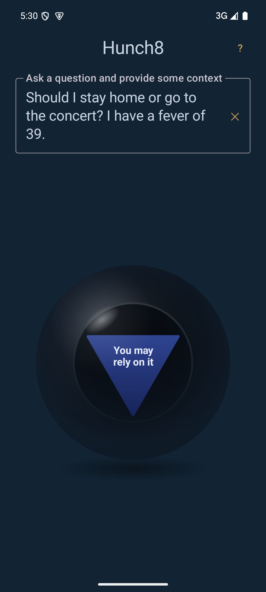
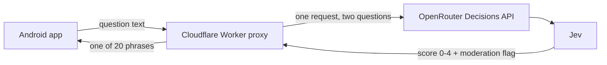

<p align="center">
  
  &nbsp;&nbsp;
  
</p>

# Hunch8

<p align="center">
  <a href="LICENSE"></a>
  <a href="https://github.com/aohana182/hunch8/issues"></a>
</p>

**Ask a yes/no question, tap the ball, and get one of the 20 classic magic 8-ball answers — chosen by a real decision model reading your question, not by a coin flip.**

Hunch8 is an Android app built on [Jev](https://openrouter.ai/docs/guides/community/jev), TypeSafe's decision model on OpenRouter. Jev doesn't write text like a chatbot: it rates how strongly the answer to your question is *yes* and returns a number. Hunch8 turns that number into the matching 8-ball phrase.

<table>
<tr><td><b>Reads your context</b></td><td>"Should I stay home or go to the concert? I have a fever of 39." gets "You may rely on it" — stay home.</td></tr>
<tr><td><b>Honest when unsure</b></td><td>When Jev isn't confident, you get "Reply hazy, try again" instead of a fake "Without a doubt".</td></tr>
<tr><td><b>Never the same twice</b></td><td>Ask again and you get a different phrase with the same verdict, like shaking a real ball.</td></tr>
<tr><td><b>Refuses hateful questions</b></td><td>Racist or harassing questions get a red ✕ instead of an answer.</td></tr>
<tr><td><b>Feels like the toy</b></td><td>The ball rolls from its 8 to the window and the answer floats up on a triangle.</td></tr>
</table>

> **For entertainment only.** Hunch8 is a toy. Don't make real decisions with it. See [DISCLAIMER.md](DISCLAIMER.md).

---

## How it works



1. You type one question with any context and tap the ball.
2. The app sends the text to a small proxy on Cloudflare Workers. The OpenRouter API key lives only there, never in the app.
3. The proxy asks Jev two things in one call: a **score** (0 = definitely no, 4 = definitely yes) and a **moderation check** (is this hateful?).
4. Flagged → the app shows a red ✕. Otherwise the score picks a band of phrases, one is chosen at random, and confidence below 0.6 always falls back to a non-committal phrase.
5. Each IP address gets 50 questions a day.

Real request/response traces, including the failures, are in [evals/traces.md](evals/traces.md).

---

## Quick start

You need your own OpenRouter API key and a Cloudflare account. This repo ships with a placeholder proxy address, so you deploy your own proxy first and then point the app at it (see [Proxy address](#proxy-address)).

**1. Proxy (Cloudflare Worker)**

```sh
git clone https://github.com/aohana182/hunch8
cd hunch8/proxy
npm install
cp .dev.vars.example .dev.vars          # put your OpenRouter key in it
npx wrangler kv namespace create RATE_LIMIT_KV   # paste the returned id into wrangler.toml
npm test
npm run dev                             # local proxy on http://127.0.0.1:8787
```

To deploy:

```sh
npx wrangler login
npx wrangler secret put OPENROUTER_API_KEY
npm run deploy
```

**2. Android app**

```sh
cd android
cp local.properties.example local.properties   # set hunch8.proxyUrl to your Worker's URL
./gradlew assembleDebug
adb install -r app/build/outputs/apk/debug/app-debug.apk
```

Requires JDK 17+ and the Android SDK (compileSdk 35, minSdk 26).

### Proxy address

The app sends every question to one address: your proxy. That address is **not** stored in the code. It lives in `android/local.properties`, which git ignores:

```properties
hunch8.proxyUrl=https://your-worker.your-subdomain.workers.dev
```

At build time, Gradle reads that line and bakes the address into the app as `BuildConfig.PROXY_URL`, which `ProxyClient.kt` uses. If the file or the line is missing, the build still succeeds but uses the placeholder `https://YOUR-WORKER.YOUR-SUBDOMAIN.workers.dev`, and every question shows "App not responding".

The address isn't a secret the way the API key is, because anyone holding a built APK can read it out of the app. Keeping it out of the repo just means the public code doesn't advertise a live endpoint. What actually protects the proxy is that the OpenRouter key never leaves Cloudflare, and the 50-questions-per-IP-per-day limit. If you run your own copy, also set a credit limit on your OpenRouter key to cap the worst case.

---

## Environment variables

| Variable | Where | Description |
|---|---|---|
| `OPENROUTER_API_KEY` | `proxy/.dev.vars` locally, `wrangler secret put` in production | OpenRouter key used to call Jev. Never goes in the app. |
| `ALLOWED_ORIGINS` | `[vars]` in `proxy/wrangler.toml` (override locally in `proxy/.dev.vars`) | Comma-separated web origins allowed to call the proxy from a browser (CORS), e.g. the web app's `https://hunch8.pages.dev`. Not needed for the Android app. |
| `hunch8.proxyUrl` | `android/local.properties` (gitignored) | Address of your deployed proxy, baked into the app at build time. See [Proxy address](#proxy-address). |

The rate-limit store is a Workers KV namespace bound as `RATE_LIMIT_KV` in `proxy/wrangler.toml`.

---

## Tech stack

- **Kotlin + Jetpack Compose** — the Android app, including the fake-3D ball drawn on a Canvas
- **OkHttp** — the app's single HTTPS call to the proxy
- **Cloudflare Workers (TypeScript)** — the proxy that holds the API key and enforces the rate limit
- **Workers KV** — per-IP daily request counters
- **OpenRouter Decisions API + Jev** (`typesafe/jev-1.13`) — the decision model

---

## Scripts

| Command | Where | Description |
|---|---|---|
| `npm test` | `proxy/` | Unit tests for the score→phrase mapping and the rate limiter |
| `npx tsc --noEmit` | `proxy/` | Type-check the Worker |
| `npm run dev` | `proxy/` | Run the proxy locally |
| `npm run deploy` | `proxy/` | Deploy the proxy to Cloudflare |
| `./gradlew assembleDebug` | `android/` | Build the debug APK |

---

## Status

Working debug build, tested on an emulator and a real phone. Not on the Play Store. Open work (release signing, app icon, Play Integrity, input length cap, crash reporting) is tracked in [tasks/todo.md](tasks/todo.md). Design decisions are in [PRD.md](PRD.md).

---

## Privacy

The app has no accounts, analytics, ads or tracking. The only thing that leaves your phone is the question you tap to ask. Full details in [PRIVACY.md](PRIVACY.md).

## Disclaimer

Entertainment only, provided as-is, with no warranty and no liability. Not affiliated with Mattel, TypeSafe or OpenRouter. Full text in [DISCLAIMER.md](DISCLAIMER.md).

---

## Contributing

```sh
git clone https://github.com/aohana182/hunch8
cd hunch8/proxy
npm install
npm test
```

See [CONTRIBUTING.md](CONTRIBUTING.md) for branching, commit format and PR process.

---

## License

MIT — see [LICENSE](LICENSE).
